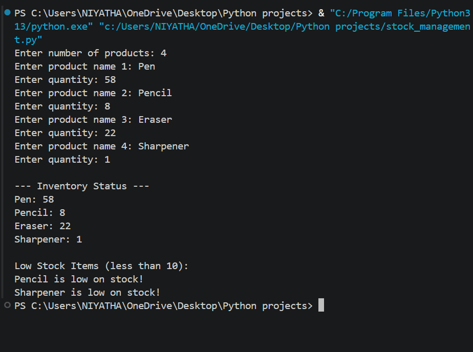

# Inventory Alert System

##  Problem Statement

Develop a Python program to manage product quantities and identify low-stock items.

## Features

* Add product details dynamically
* Store product names and quantities
* Display complete inventory status
* Identify low-stock items (less than 10 units)
* Simple and user-friendly interface

---

## Technologies Used

* Python
* Dictionaries
* Loops & Conditional Statements
* Basic Input/Output

---
## How to Run

1. Open VS Code or any Python IDE
2. Create a file `inventory_system.py`
3. Paste the code
4. Run using:

   ```
   python inventory_system.py
   ```

---

## Output Screenshots

<div align="center">



<br><br>

</div>

---
